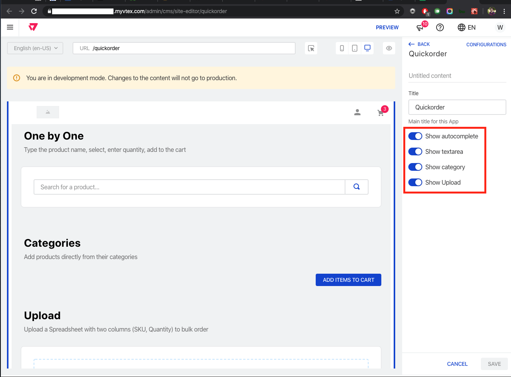

# VTEX Quickorder

## Description

The VTEX Quickorder app is a store component that enables a B2B buyer to speedup buying process by ofering tools to bulk order.

:loudspeaker: **Disclaimer:** Don't fork this project, use, contribute, or open issue with your feature request.

## Release schedule

| Release |       Status        | Release Date | Store Compatibility |
| :-----: | :-----------------: | :----------: | :-----------------: |
| [0.7.0] | **Current Release** |  2020-04-14  |         2.x         |
| [0.6.0] |   **Deprecated**    |  2020-04-13  |         2.x         |
| [0.5.8] |   **Deprecated**    |  2020-02-24  |         2.x         |
| [0.5.7] |   **Deprecated**    |  2020-02-20  |         2.x         |
| [0.5.6] |   **Deprecated**    |  2020-02-20  |         2.x         |
| [0.5.5] |   **Deprecated**    |  2020-02-19  |         2.x         |

See our [LTS policy](https://github.com/vtex-apps/awesome-io#lts-policy) for more information.

## Table of Contents

- [Features](#features)
- [Usage](#usage)
- [Configuration](#configuration)
- [CSS namespaces](#css-namespaces)
- [Troubleshooting](#troubleshooting)
- [Contributing](#contributing)

## Features

To enable/disable these features, check the [Usage](#usage) section

### One by One

Type the product name, select, inform the quantity and add to the cart


### Copy & Paste

Copy a list containing two columns (SKU, Quantity) and Paste it inside the text area


### Categories

This feature is only recommended if you don't have more than 50 SKUs by category, if your store is eligible, open the categories, choose the quantities and add all at once


### Upload

You can also upload a Spreadsheet containing two columns (SKU, Quantity) as shown below


## Usage

You can also simply install by running `vtex install vtex.quickorder` on your environment

**_OR_**

This app uses our store builder with the blocks architecture. To know more about the Store Builder [click here](https://help.vtex.com/en/tutorial/understanding-storebuilder-and-stylesbuilder#structuring-and-configuring-our-store-with-object-object).

To configure or customize this app, you need to import it in your dependencies in `manifest.json`.

```json
  dependencies: {
    "vtex.quickorder": "0.x"
  }
```

Both ways will make available its own Route `/quickorder`, in order to create a different route, please configure it at `/admin/cms/pages`.

You can also configure it in your store, to do so, add `quickorder` block into your app theme as we do in our [Store theme app](https://github.com/vtex-apps/store-theme/blob/master/store/blocks.json).

#### Configuration

To change any configuration aspect, please navigate to `/admin/cms/site-editor/quickorder` to activate/inactivate modules or change the title


#### CSS namespaces

Below, we describe the namespaces that are defined in the _quickorder_.

| Class name                   | Description                          |
| ---------------------------- | ------------------------------------ |
| `container`                  | The main container of quickorder     |
| `title`                      | Main title of the component          |
| `copyPasteBlock`             | Copy & Paste Block                   |
| `autocompleteBlock`          | Autocomplete Block                   |
| `reviewBlock`                | Review Block                         |
| `buttonsBlock`               | Review Buttons container             |
| `buttonValidate`             | Copy & Paste "Validate" button       |
| `skuSelection`               | Autocomplete SKU items for selection |
| `productThumb`               | Autocomplete product thumb image     |
| `productLabel`               | Autocomplete product label           |
| `inputQuantity`              | Autocomplete product quantity field  |
| `buttonAdd`                  | Autocomplete Add to the Cart button  |
| `categoryContainer`          | Category container                   |
| `categoryTitle`              | Category Title                       |
| `categoryHelper`             | Category Helper                      |
| `categoryProductLabel`       | Product name on the list             |
| `categoryInputQuantity`      | Input quantity container             |
| `categoryButtonAdd`          | Add button at the product list       |
| `categoriesSubCategory`      | Sub-category containerr              |
| `categoriesProductContainer` | Products list container              |
| `categoryLoadingProducts`    | Products "Loading" message           |
| `dropzoneContainer`          | Dropzone file/upload container       |
| `dropzoneText`               | Dropzone text                        |
| `dropzoneLink`               | Dropzone link                        |

## Troubleshooting

You can check if others are passing through similar issues [here](https://github.com/vtex-apps/quickorder/issues). Also feel free to [open issues](https://github.com/vtex-apps/quickorder/issues/new) or contribute with pull requests.

## Contributing

Check it out [how to contribute](https://github.com/vtex-apps/awesome-io#contributing) with this project.
